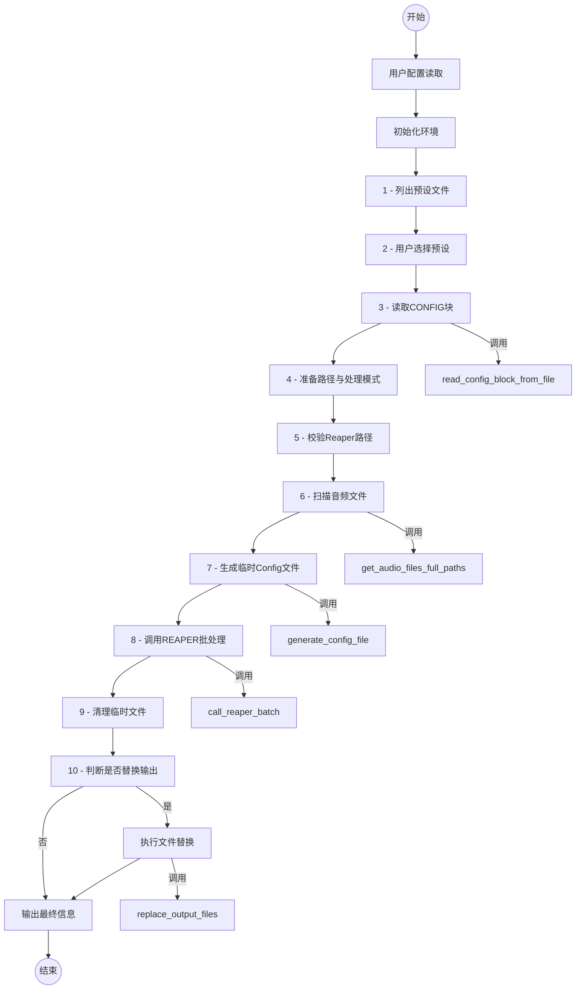

# Reaper_BatchConverter.py 程序逻辑架构

本文档描述了 `Reaper_BatchConverter.py` 脚本的程序逻辑、主要函数及其交互和关键变量。

## 1. 整体逻辑流程

## 2. 主程序逻辑 (`if __name__ == '__main__':`) 详解

主程序块负责协调整个批处理流程。

1.  **用户可配置变量**:
    *   `reaper_exe`: Reaper 主程序 (`reaper.exe`) 的完整路径。
        *   例: `r"C:\Program Files\REAPER (x64)\reaper.exe"`
    *   `presets_dir`: 存储 Reaper 预设配置文件 (`.txt` 文件) 的目录路径。
        *   例: `r"D:\02.Projects_Files\Otoful_PluginPresets\Reaper_Presets"`

2.  **初始化**:
    *   `audio_directory`: 获取当前脚本运行的目录 (`os.getcwd()`)，作为待处理音频文件的来源目录。

3.  **步骤 1: 列出所有 `.txt` 配置文件**:
    *   变量:
        *   `all_files`: 一个列表，存储 `presets_dir` 目录下所有以 `.txt` 结尾的文件名。通过 `os.listdir()` 获取并筛选。
    *   逻辑: 尝试读取 `presets_dir`，如果失败或没有找到 `.txt` 文件，则打印错误并退出。
    *   输出: 向用户打印可用的预设文件列表，并编号。

4.  **步骤 2: 用户交互 - 选择配置文件**:
    *   变量:
        *   `sel`: 用户输入的预设编号字符串。
        *   `sel_idx`: 转换后的整数索引 (用户输入 - 1)。
        *   `chosen_file`: 用户根据编号选择的预设文件名 (从 `all_files` 列表中获取)。
    *   逻辑: 获取用户输入，验证其有效性。如果无效则退出。
    *   `external_config_path`: 构造所选预设文件的完整路径 (`os.path.join(presets_dir, chosen_file)`).

5.  **步骤 3: 读取 CONFIG 块**:
    *   调用: `read_config_block_from_file(external_config_path)`
    *   返回:
        *   `external_config_block`: 从预设文件中读取的配置块内容 (字符串)。
        *   `outpattern_suffix`: 从预设文件中提取的 `OUTPATTERN $source` 后缀部分，如 `-converted`。
    *   逻辑: 如果 `external_config_block` 为 `None` (读取失败)，则退出。

6.  **步骤 4: 准备音频文件列表与临时 config 路径**:
    *   `outpattern_suffix`: 如果上一步未能从文件解析出 `outpattern_suffix`，则赋予默认值 `"-converted"`。
    *   `config_filename`: 临时生成的 Reaper 批处理配置文件名，路径为 `os.path.join(audio_directory, "batch_config_temp.txt")`。
    *   `log_filename`: Reaper 批处理可能生成的日志文件名，通常为 `config_filename + ".log"`。

7.  **步骤 5: 校验 `reaper.exe`**:
    *   逻辑: 使用 `os.path.exists(reaper_exe)` 检查 Reaper 执行文件路径是否有效。如果无效则打印错误并退出。

8.  **步骤 6: 扫描音频文件**:
    *   调用: `get_audio_files_full_paths(audio_directory)`
    *   返回:
        *   `audio_file_full_paths`: 一个列表，包含 `audio_directory` 中所有支持的音频文件的完整绝对路径。
    *   逻辑: 如果未找到音频文件，则打印错误并退出。

9.  **步骤 7: 生成临时 config**:
    *   调用: `generate_config_file(config_filename, audio_file_full_paths, external_config_block)`
    *   逻辑: 如果配置文件生成失败，则退出。

10. **步骤 8: 调用 REAPER 批处理**:
    *   调用: `call_reaper_batch(reaper_exe, config_filename)`
    *   返回:
        *   `reaper_call_reported_success`: 布尔值，指示 Reaper 命令行调用是否报告成功。

11. **步骤 9: 清理临时文件**:
    *   逻辑: 尝试删除 `config_filename` 和 `log_filename`。如果删除失败，打印警告。

12. **步骤 10: 替换输出 (核心判断逻辑)**:
    *   变量:
        *   `attempt_replacement`: 布尔值，初始为 `False`。
    *   逻辑:
        *   如果 `reaper_call_reported_success` 为 `True`，则设置 `attempt_replacement = True`。
        *   如果 `reaper_call_reported_success` 为 `False`，则进一步检查：
            *   遍历 `audio_file_full_paths`。
            *   对每个原始文件路径，构造预期的输出文件名 (`base + outpattern_suffix + ext`)。
            *   使用 `os.path.exists()` 检查此预期输出文件是否实际存在。
            *   如果至少有一个预期的输出文件存在 (`generated_file_actually_exists = True`)，则设置 `attempt_replacement = True`。
    *   如果 `attempt_replacement` 最终为 `True`:
        *   调用: `replace_output_files(audio_file_full_paths, outpattern_suffix)`
    *   根据 `reaper_call_reported_success` 和 `attempt_replacement` 的状态打印不同的总结信息。

13. **结束**:
    *   `input("\n按回车键退出...")`: 等待用户按回车键后退出脚本。

## 3. 函数详解

### 3.1. `read_config_block_from_file(config_block_path)`

*   **功能**: 从指定的外部文件读取 Reaper 配置块，并尝试提取 `OUTPATTERN` 信息。
*   **参数**:
    *   `config_block_path` (str): 包含配置块的文件的完整路径。
*   **内部主要变量**:
    *   `lines` (list): 文件所有行的列表。
    *   `outpattern` (str or None): 从文件中匹配到的 `OUTPATTERN $source` 后面的部分 (例如 `_FX` 或 `-converted`)。
    *   `clean_lines` (list): 存储处理后的文件行。
    *   `match` (re.Match object or None): 正则表达式搜索 `OUTPATTERN` 的结果。
*   **处理逻辑**:
    1.  以 UTF-8 编码打开并读取 `config_block_path` 文件的所有行。
    2.  遍历每一行：
        *   如果行内包含 `'OUTPATTERN'`，则使用正则表达式 `r'OUTPATTERN\s+\$source([-_\w]*)'` 尝试匹配并提取 `outpattern`。
        *   所有行（无论是否处理过 `OUTPATTERN`）都被添加到 `clean_lines`。
    3.  将 `clean_lines` 合并为一个字符串。
*   **返回**:
    *   一个元组 `(config_string, outpattern)`:
        *   `config_string` (str): 文件内容的字符串形式。
        *   `outpattern` (str or None): 提取到的 `outpattern` 后缀，如果未找到则为 `None`。
    *   如果发生异常，打印错误并返回 `(None, None)`。

### 3.2. `get_audio_files_full_paths(directory, extensions=None)`

*   **功能**: 扫描指定目录，返回所有支持的音频文件的完整绝对路径列表。
*   **参数**:
    *   `directory` (str): 需要扫描的目录路径。
    *   `extensions` (set, optional): 一个包含音频文件扩展名（如 `".wav"`, `".mp3"`）的集合。如果为 `None`，则使用一组默认扩展名。
*   **内部主要变量**:
    *   `audio_files_full_paths` (list): 存储找到的音频文件完整路径。
    *   `filename` (str): 目录中的文件名。
    *   `full_path` (str): 文件的完整路径。
*   **处理逻辑**:
    1.  如果 `extensions` 未提供，则初始化为一组常见的音频扩展名。
    2.  遍历 `directory` 中的每个条目 (`os.listdir()`)。
    3.  对每个条目，构造其完整路径 (`os.path.join()`)。
    4.  检查该路径是否是一个文件 (`os.path.isfile()`) 并且其扩展名（小写）是否在 `extensions` 集合中。
    5.  如果是，则将其绝对路径 (`os.path.abspath()`) 添加到 `audio_files_full_paths` 列表中。
*   **返回**:
    *   `audio_files_full_paths` (list): 找到的音频文件完整路径列表。
    *   如果发生异常，打印错误并返回 `None`。

### 3.3. `generate_config_file(config_filename, audio_file_full_paths, external_config_block)`

*   **功能**: 根据提供的配置块和音频文件列表，生成一个临时的 Reaper 批处理配置文件。
*   **参数**:
    *   `config_filename` (str): 要生成的配置文件的完整路径和名称。
    *   `audio_file_full_paths` (list): 包含所有待处理音频文件完整路径的列表。
    *   `external_config_block` (str): 从外部预设文件读取的配置内容。
*   **内部主要变量**:
    *   `config_content` (str): 组合后的完整配置文件内容。
*   **处理逻辑**:
    1.  检查 `external_config_block` 是否为空。如果为空，打印错误并返回 `False`。
    2.  将 `external_config_block` 和 `audio_file_full_paths` (每行一个路径) 组合成 `config_content` 字符串。
    3.  以 UTF-8 编码打开 `config_filename` 进行写入，并将 `config_content` 写入文件。
*   **返回**:
    *   `True` 如果文件写入成功。
    *   `False` 如果发生 `IOError` (打印错误信息)。

### 3.4. `call_reaper_batch(reaper_exe, config_filename)`

*   **功能**: 调用 Reaper 的命令行接口执行批处理操作。
*   **参数**:
    *   `reaper_exe` (str): Reaper 可执行文件的完整路径。
    *   `config_filename` (str): 之前生成的临时批处理配置文件的路径。
*   **内部主要变量**:
    *   `command` (list): 构建的命令行参数列表，例如 `[reaper_exe, "-batchconvert", config_filename]`。
    *   `result` (subprocess.CompletedProcess): `subprocess.run` 的执行结果。
    *   `stdout_decoded` (str): Reaper 进程的标准输出 (UTF-8 解码)。
    *   `stderr_decoded` (str): Reaper 进程的标准错误输出 (UTF-8 解码)。
*   **处理逻辑**:
    1.  检查 `config_filename` 是否存在。如果不存在，打印错误并返回 `False`。
    2.  构建 `command` 列表，并使用 `shlex.quote` 对参数进行转义，打印将要执行的命令。
    3.  使用 `subprocess.run()` 执行命令，设置 `check=True` (如果 Reaper 返回非零退出码则抛出 `CalledProcessError`)，并捕获标准输出和标准错误。
    4.  解码捕获的输出 (stdout/stderr) 为 UTF-8 字符串，替换无法解码的字符。
    5.  打印 Reaper 的标准输出和错误输出。
*   **返回**:
    *   `True` 如果 Reaper 调用成功完成 (退出码为0)。
    *   `False` 如果发生 `subprocess.CalledProcessError` (Reaper 返回错误) 或其他执行命令时的异常 (均打印详细错误信息)。

### 3.5. `replace_output_files(audio_file_full_paths, pattern_suffix="-converted")`

*   **功能**: 在 Reaper 批处理完成后，用生成的输出文件覆盖原始音频文件。
*   **参数**:
    *   `audio_file_full_paths` (list): 原始音频文件的完整路径列表。
    *   `pattern_suffix` (str): Reaper 输出文件名相对于原文件名的后缀 (例如 `"-converted"`，来源于 `OUTPATTERN $source` 的解析结果或默认值)。
*   **内部主要变量**:
    *   `path` (str): 列表中的单个原始音频文件路径。
    *   `base` (str): `path` 的基本名称 (不含扩展名)。
    *   `ext` (str): `path` 的扩展名。
    *   `generated` (str): 根据 `base`, `pattern_suffix`, `ext` 构造的 Reaper 生成的输出文件名。
*   **处理逻辑**:
    1.  遍历 `audio_file_full_paths` 中的每个原始文件路径 (`path`)。
    2.  分离路径得到基本名 `base` 和扩展名 `ext` (`os.path.splitext()`)。
    3.  构造预期的输出文件名 `generated = base + pattern_suffix + ext`。
    4.  检查 `generated` 文件是否存在 (`os.path.exists()`):
        *   如果存在:
            1.  尝试删除原始文件 `path` (`os.remove()`)。
            2.  短暂暂停 (`time.sleep(0.1)`)，可能为了确保文件系统操作完成。
            3.  尝试将 `generated` 文件重命名为原始文件名 `path` (`os.rename()`)。
            4.  打印成功覆盖的消息。
            5.  如果在删除或重命名过程中发生异常，打印错误信息。
        *   如果不存在:
            *   打印警告，提示找不到对应的输出文件。
*   **返回**:
    *   无 (`None`)。函数直接打印操作结果。 